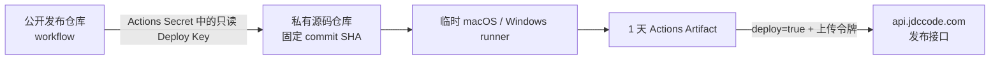

# 用公开 GitHub Actions 构建私有源码

## 目标

`u53/jdc-code-release` 是公开的发布编排仓库，`u53/jdc-code` 仍是私有源码仓库。公开仓库使用 GitHub 托管 runner 构建桌面客户端，但不会把源码提交、镜像或同步到公开 Git 历史。

## 哪些内容会公开

| 内容 | 是否公开 | 说明 |
| --- | --- | --- |
| workflow 与本说明 | 是 | 任何人都可以审查构建步骤 |
| Actions 运行状态与普通日志 | 是 | 不应主动打印源码、环境变量或 Secret |
| 私有源码 Git 历史 | 否 | 仅在临时 runner 内按固定 SHA 检出 |
| Deploy Key 私钥 | 否 | 只存在于 `JDC_SOURCE_REPO_SSH_KEY` Secret |
| Apple 证书、证书密码、上传令牌 | 否 | 只存在于仓库 Secrets |
| DMG、EXE、更新元数据 | 按发布流程 | 短期 Artifact 保留 1 天；正式版本上传到 JDC Cloud API |

GitHub 会遮蔽已登记的 Secret，但无法阻止脚本主动读取并编码输出 Secret。因此只有仓库管理员可以修改默认分支上的 workflow，任何外部改动都必须先审查。

## 为什么不会暴露源码

1. 公开仓库没有私有源码 remote，也没有源码 commit。
2. `actions/checkout` 使用 `repository: u53/jdc-code` 和只读 Deploy Key，检出目录仅存在于单次 runner。
3. workflow 先把分支或标签解析为不可变 commit SHA，macOS 与 Windows 构建同一版本。
4. 上传步骤只收集顶层安装包、blockmap 和 `latest-*.yml`，不会上传工作区、source map、解包目录或 `.git`。
5. runner 在 job 结束后销毁，Deploy Key 没有私有仓库写权限。

公开日志仍可能出现文件路径、依赖名称、测试名称和编译错误片段。这些属于可观察的构建元数据；构建脚本不得使用 `set -x`，也不得打印源码文件、完整环境变量、请求鉴权头或证书内容。

## 初次配置

### 1. 配置只读 Deploy Key

生成一把独立 SSH Key。公钥添加到私有 `u53/jdc-code` 的 **Settings → Deploy keys**，不要勾选写权限；私钥添加到公开仓库 Secret `JDC_SOURCE_REPO_SSH_KEY`。

一把 Deploy Key 只服务这一条发布链路，不与个人 SSH Key、服务器部署 Key 或其他 CI 共用。私钥丢失时不能恢复，应删除旧 Deploy Key 后重新生成。

### 2. 配置变量和 Secrets

仓库 Variable：

- `JDC_CLOUD_API_URL=https://api.jdccode.com`

仓库 Secrets：

- `JDC_SOURCE_REPO_SSH_KEY`
- `CSC_LINK`
- `CSC_KEY_PASSWORD`
- `APPLE_TEAM_ID`
- `JDC_RELEASE_UPLOAD_TOKEN`

`CSC_LINK` 是 Developer ID Application `.p12` 的 Base64 内容。当前只执行 codesign，不执行 notarization，因此不需要 Apple ID 或 App-Specific Password。

GitHub Secret 是单向写入的，API 只能列出名称，不能读取或跨仓库复制原值。从旧仓库迁移时必须使用原始证书和令牌重新设置，不能把它们临时提交到代码。

### 3. 配置发布 Environment

部署 job 使用 `desktop-release-promote` Environment。建议在仓库设置中加入 required reviewer；否则 Environment 名称本身不构成人工审批门。

不要增加接收外部代码并携带 Secrets 的 `pull_request_target` 触发器。当前 workflow 仅允许仓库管理员手动 `workflow_dispatch`，普通 push、外部 PR 和 fork 不会启动发布。

## 标准发布顺序

1. 将待发布代码提交并推送到私有 `jdc-code`。
2. 等待生产 API 部署完成，确认 `https://api.jdccode.com/api/jdc/v1/health` 返回成功。
3. 在公开仓库 Actions 页面运行 **Desktop Client Release**。
4. 首次或排障时先用完整 commit SHA、`platform=all`、`deploy=false` 构建，只检查签名和产物。
5. Windows 未签名安装包按服务端安全门登记绑定 SHA-256 的独立 clearance。
6. 使用同一源码 SHA、`platform=all`、`deploy=true` 正式上传。
7. 检查 Cloud API 的最新版本、macOS/Windows 下载接口和客户端更新。

不要直接用移动中的 `main` 作为正式发布凭据。虽然 workflow 会在运行开始时固定 SHA，运维记录和 clearance 仍应保存该 SHA、桌面版本号及构建 run URL。

## 轮换与应急撤销

- 源码读取权限：删除私有仓库中的 Deploy Key，所有新构建立即无法检出源码。
- 上传权限：轮换服务端 `JDC_RELEASE_UPLOAD_TOKEN`，再更新公开仓库 Secret。
- Apple 证书：证书泄漏或人员变更时在 Apple Developer 后台撤销证书，重新导出 `.p12` 并更新两个签名 Secrets。
- workflow 被异常修改：先禁用 Actions 或删除 Deploy Key，再审查 Git 历史和 Actions 日志；不要只删除一次 run。

GitHub 对公开仓库 runner 的计费与额度政策可能变化，应以 GitHub 当前条款为准；本架构解决的是源码隔离与发布编排，不是永久计费承诺。

